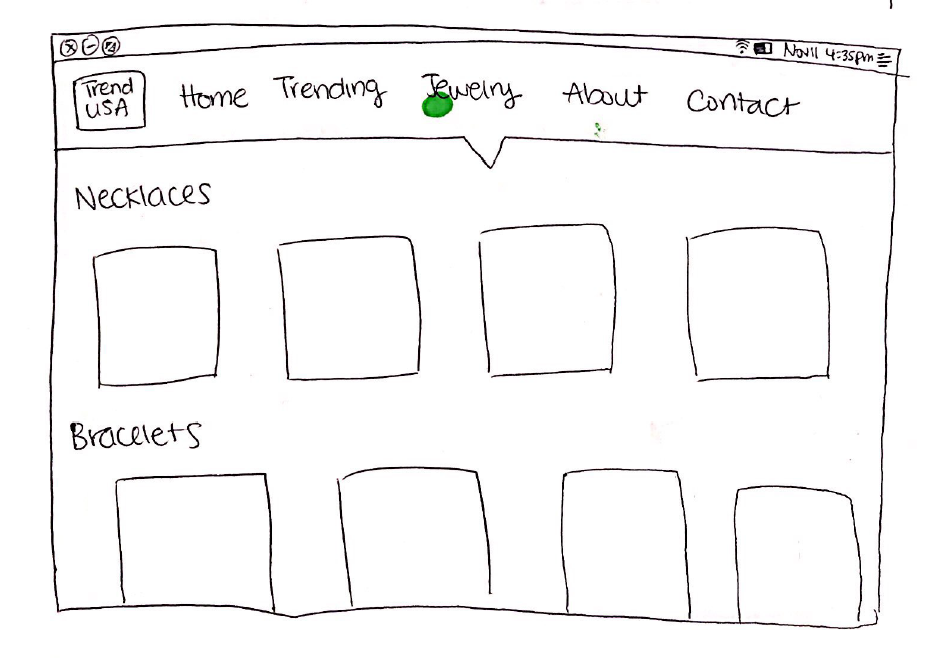
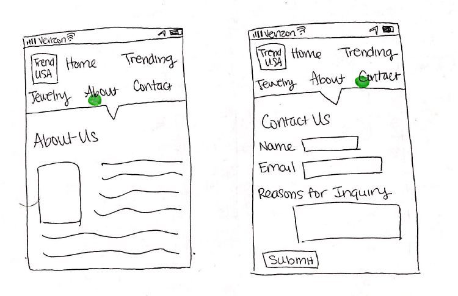

# Project 4 - Design & Plan

Your Team Name: Silver Mammoth

## Milestone 1: Design your Client's Site

### Client Selection (Milestone 1)

#### Client Description (Samantha)

[Tell us about your client. Who is your client? What kind of website do they want? What are their key goals?]

[NOTE: If you are redesigning an existing website, give us the current URL and some screenshots of the current site. Tell us how you plan to update the site in a significant way that meets the Project 4 requirements.]

Our client is Themis Hsieh, an assistant manager at Trend International, which is a jewelry wholesale company with an office in Long Island City. They want a website that can serve as a basic catalogue for their products by displaying images of current pieces. Their key goals include displaying all relevant information to their customers as well as look "beautiful and elegant". They currently do not have a website for their USA office.


### Client Needs & Wants/Requirements (Milestone 1)

#### Purpose & Content (Kelly)

[Tell us the purpose of the website and what it is all about.]

- The purpose of the website is to communicate information about the mission of Trend International and its products. The content of the site will include a full catalogue of their products, trending products, the mission of Trend International, and a contact page for inquiries.

#### Client Needs and Wants (Clive)

[Collect your client's needs and wants for the website. Come up with several appropriate design ideas on how those needs may be met. In the **Memo** field, justify your ideas and add any additional comments you have. There is no specific number of needs required for this, but you need enough to do the job.]

- Needs/Wants #1
  - **Needs and Wants** [What does your client and audience need and want?]
    - Client needs to have organized visual displays of the merchandise (jewelry).
  - **Design Ideas and Choices** [How will you meet those needs and wants?]
    - Dedicate a page for navigating through the merchandise offered by the client.
  - **Memo** [Justify your decisions; additional notes.]
    - This makes it easy for the target audience (retailers) to find what they want.


- Needs/Wants #2
  - **Needs and Wants** [What does your client and audience need and want?]
    - Trend International needs their clients to be able  to communicate easily with them.
  - **Design Ideas and Choices** [How will you meet those needs and wants?]
    - Create a 'Contact Us' page with a contact form and/or provide all the necessary contact information for our client.
  - **Memo** [Justify your decisions; additional notes.]
    - This makes it easy for the target audience (retailers) to have their lingering questions answered. It also helps our client engage with their potential customers.


- Needs/Wants #3
  - **Needs and Wants** [What does your client and audience need and want?]
    - From the client: "For the website, we are thinking to build classy, elegant web site that is geared more towards advertising the company than actually selling jewelry on internet."
    So, the website has to be visually appealing and interactive enough to attract new customers.
  - **Design Ideas and Choices** [How will you meet those needs and wants?]
    - We will use high quality photos for an elegant feel, and use JavaScript for smooth interactivity.
  - **Memo** [Justify your decisions; additional notes.]
    - These designs must be implemented for Trend International to be competitive since other jewelry wholesale companies use the same methods.

#### Client Meeting Notes (Samantha)

[By this point, you have met once with your client to discuss all their requirements. Include your notes from the meeting, an email they sent you, or whatever you used to keep track of what was discussed at the meeting. Include these artifacts here.]

We held a Skype meeting with our Client. Our group met up together and video-chatted our client together, and we discussed many features of the website. We have attached the follow-up email that our client sent us, and also the notes that our note-taker took during the Skype meeting.


### Target Audience (Milestone 1)

#### Target Audience(s) (Samantha)

  - The target audience of this website as described by our client would be big retail companies, such as JC Penny, Nordstrom, or Macy's that sell jewelry purchased from Jewelry wholesale companies. In addition, our client mentioned that their company sells to wholesalers, retailers, designers, and also chain store representatives.

#### Target Audience Needs (Kelly)

[What are the needs of your target audience(s)? Note that these are probably *not* the needs of your client.]

  - Employees making purchasing decisions for retailers/wholesalers want to find quality jewelry on a website, and therefore would like to see quality pictures and clear information on the materials the jewelry are made of, as well as their prices.
  - Designers would also be interested in knowing what materials the products are made of, as well as their specs (sizes, etc.) and prices.

### Initial Design (Milestone 1)

#### Content (Samantha)

[Place your content in the **content** folder. NOT in the documents folder.]

[Note any content (e.g., text, image) that you need to make/get from the client here.]

Applicable content for our website includes the pictures of the jewelry (necklaces, bracelets, rings, earrings) that will be put on display.

#### Content Organization, Information Architecture, and Navigation (David)

[Lay out the plan for how you'll organize the site and which content will go where. Plan out the navigation for the site. Document your process for organizing the content.]

[Note: As with the Needs and Wants table, there is no specific amount to write here. You simply need enough content to do the job.]

Example:
- **Navigation**
  - Home
  - Trending
  - Jewelry
    - Necklaces
    - Bracelets
    - Rings
    - Earrings
  - About
  - Contact

- **Content** (List all the content corresponding to main navigation and sub-categories.)
  - *Home*: Summaries of the categories listed in Jewelry and a small preview;
  - *Trending*: show the currently trending items from the entire collection;
  - *Jewelry*: Showcase jewelry in the collection;
    - *Necklaces*: Necklaces in collection
    - *Bracelets*: Bracelets in collection
    - *Rings*: Rings in collection
    - *Earrings*: Earrings in collection
  - *About*: Show the company mission and team.
  - *Contact*: Display form to collect inquiries from users. Also display email, phone and mailing address

- **Process**
  - 
  - We utilized the card sort procedure to organize the content and navigation.

#### Sketches (Samantha)

[Include exploratory idea sketches of your website.]


[Include sketches of your finalized design.]

- 
- 
- 
- 
- 
- 
- 

#### Interactivity (clive & david)

[What interactive features will your site have? Describe how the interactivity connects with the needs of the clients/target audience.]

  - For mobile view, there will be menu that toggles between showing and hiding the menu items.

    - Reason: Users of the website may be accessing it from mobile devices as well as desktops/laptops, so our navigation must be responsive.


  - There will also be custom form validation for the contact page form.

    - Reason: It would make it easier for our clients to check that the user is entering valid information.


  - Users will have the option to filter the images in the jewelry collection.

    - Reason: This will make searching for items and comparing them easier

  - We will also include hover effects for when the clients moves the cursor on an images

    - This will focus on the current image and look pleasant in general too.


#### Additional Comments (Milestone 1)

[If you feel like you haven't fully explained your design choices, or if you want to explain some other functions in your site (such as special design decisions that might not meet the Project 4 requirements), you can use this space to justify your design choices or ask other questions about the project and process.]


## Milestone 2: Draft of Coded Website

### Interactivity (Milestone 2) (Clive)

[Write your interactivity pseudocode here. Remember you must use two conditional statements.]

Contact Form
```
Upon submit:

  if name is a not valid text or is empty, display message "Please enter a valid name". Do not submit form.

  if email is not valid or is empty, display message "Please enter a valid email address". Do not submit form.

  if message field is empty, display message "Please write your message here". Do not submit form.

  Otherwise, submit form
```

Mobile Menu Toggle
```
upon menu icon click:

  if menu <ul> contains class "hidden", remove class "hidden"

  Otherwise, add class "hidden" to menu <ul>
```

### Tasks (Milestone 2) (Kelly)

[You will need to come up with at least 4 tasks. List your tasks here. You *do not* have to do user tests yet.]

Task 1: Identify a gold gemstone product.

Task 2: Locate where Trend USA's products are manufactured.

Task 3: Send a question to Trend USA asking how to obtain product quotes.

Task 4: Point out a few popular pieces offered by Trend USA.

### Client Meeting (Milestone 2) (Samantha Chu)

[By this point, you have met once with your client a second time to discuss your initial design. Include your notes from the meeting, an email they sent you, or whatever you used to keep track of what was discussed at the meeting. Write a few sentences about the design feedback you received from your client.]

We had a second Skype meeting with our client. After showing our client the initial design of the website, they liked the feel for the site. However, they had a couple changes from the original layout that they sent us. They wanted us to split the jewelry webpage into different categories, as noted in the meeting notes.


### Additional Comments (Milestone 2)

[If you feel like you haven't fully explained your design choices, or if you want to explain some other functions in your site (such as special design decisions that might not meet the Project 4 requirements), you can use this space to justify your design choices or ask other questions about the project and process.]


## Milestone 3: Presentation & Demo Ready Draft

### Additional Comments (Milestone 3)

[If you feel like you haven't fully explained your design choices, or if you want to explain some other functions in your site (such as special design decisions that might not meet the Project 4 requirements), you can use this space to justify your design choices or ask other questions about the project and process.]


## Final Submission: Complete, Polished, and User Tested Website

### Changes Based on Presentation (Final Submission)

[What changes did you make to your plan or design based on your peers' feedback?]

### User Testing (Final Submission)

#### Participant 1

1. Who is your participant, e.g., what is their name, where do they comes from, what is their job, characteristics, etc.?
Participant 1 is Eula Wood. She is from California and previously owned her own jewelry store in Hong Kong, where she sold accessories she made and bought from other sources. She is now retired and enjoys making jewelry in her spare time. Eula has a bright personality and seems passionate about jewelry. She was excited for the interview.

2. Does your participant belong to your target audience of the site? (Yes / No)

[If “No”, what’s your strategy of associating the user test results to your target audience’s needs and wants? How can your re-design choices based on the user tests make a better fit for the target audience?]
Yes, retailer.

[Report the results for your user's performance on each of your tasks. You should **describe the task** you ask the user to complete, explain **what the user did**, describe the user's **reaction/feedback** to the design, **reflect on the user's performance**, determine what **re-design choices** you will make. You can also add any additional comments in the **memo** field.]

Format:
- Task #1
  - **Task Description** (What was the task for this user?)
    - Identify a gold gemstone product.
  - **How did the user do? Did that meet your expectation?**
    - Eula hovered over the 14k/10k tab and navigated down to the "Plain Gold" dropdown, then the "Gemstone" dropdown
    - this met our expectation, and it was clear how Eula's thought process was as she tried to complete the task
  - **User’s reaction / feedback to the design** (e.g., specific problems or issues found in the tasks)
    - Eula thought it was pretty clear for the most part, but didn't understand the difference between 14k/10k and Plain Gold. Thought it may have been better to switch, since plain gold is more general
  - **Your reflections about the user’s performance to the task**
    - It was good feedback to know more about jewelry terminology, since we don't know the difference between plain gold and the different carats of gold. We were surprised the user didn't also click on the 14/10k gold page.
  - **Re-design choices**
    - We'll clarify the naming conventions of the product lines and see if there should be any adjustments to how the gold dropdown bar (and the other nav tabs) are named, in order to avoid confusion from the site visitors.
  - **Memo** (Justify your decisions; additional notes.)
    - [You should fill this out]
- Task #2
  - **Task Description** (What was the task for this user?)
    - Find out where Trend USA's products are manufactured.
  - **How did the user do? Did that meet your expectation?**
    - Eula first went to the home page and scrolled down
    - then went to the about page and after skimming the content, found that Trend USA's products are manufactured in Guangzhou.
    - This also met our expectation
  - **User’s reaction / feedback to the design** (e.g., specific problems or issues found in the tasks)
    - Thought it made sense, but would also want more info on Trend international as a whole, if she could get products shipped to Asia as well
  - **Your reflections about the user’s performance to the task**
    - We didn't think about adding much info to page about Trend International's global branch, but will look to ask about that info.
  - **Re-design choices**
    - Perhaps adding links to Trend International's global pages or talking about it on the about page.
  - **Memo** (Justify your decisions; additional notes.)
    - [You should fill this out]
- Task #3
  - **Task Description** (What was the task for this user?)
    - Send a question to Trend USA asking how to obtain product quotes.
  - **How did the user do? Did that meet your expectation?**
    - Went to contact, filled out all the spaces and submitted successfully.
    - This also met our expectation
  - **User’s reaction / feedback to the design** (e.g., specific problems or issues found in the tasks)
    - Thought it was a little open ended, perhaps should add section for users to specify which products they're asking about
  - **Your reflections about the user’s performance to the task**
    - Agreed, perhaps there should be more indication on the form that should be customized for a jewelry website rather than just a simple message.
  - **Re-design choices**
    - Adding more sections on the form, optional or required, that would help filter order messages.
  - **Memo** (Justify your decisions; additional notes.)
    - [You should fill this out]
- Task #4
  - **Task Description** (What was the task for this user?)
    - Point out a few popular pieces offered by Trend USA.
  - **How did the user do? Did that meet your expectation?**
    - She went to the trending tab and clicked through the slideshow
    - This also met our expectation
  - **User’s reaction / feedback to the design** (e.g., specific problems or issues found in the tasks)
    - Thought it was hard to identify which exact pieces were trending, that they were just pictures.
  - **Your reflections about the user’s performance to the task**
    - It is true that the page is a bit vague in terms of defining which pieces are trending. We were going more of the styles of trending.
  - **Re-design choices**
    - Perhaps some links on the page to specific products, materials, or pages would help this.
  - **Memo** (Justify your decisions; additional notes.)
    - [You should fill this out]


[Include evidence of your user testing process.]

#### Participant 2

1. Who is your participant, e.g., what is their name, where do they comes from, what is their job, characteristics, etc.?
Participant 2 is Everly Chae, a junior at Cornell who studies Material Science Engineering. She interned in the sourcing & inventory department of Coach Outlets, where she analyzed selections of purses and accessories from different coach lines to be sold in the outlets. Everly is friendly and a hard worker.

2. Does your participant belong to your target audience of the site? (Yes / No)

[If “No”, what’s your strategy of associating the user test results to your target audience’s needs and wants? How can your re-design choices based on the user tests make a better fit for the target audience?]
Yes, worked in retail inventory

- Task #1
  - **Task Description** (What was the task for this user?)
    - Identify a gold gemstone product.
  - **How did the user do? Did that meet your expectation?**
    - Everly clicked on "browse gold jewelry" on the homepage shortcut, then clicked "gemstone"
    - This met our expectation.
  - **User’s reaction / feedback to the design** (e.g., specific problems or issues found in the tasks)
    - Everly thought it was fine.
  - **Your reflections about the user’s performance to the task**
    - Glad Everly navigated the site easily.
  - **Re-design choices**
    - None.
  - **Memo** (Justify your decisions; additional notes.)
    - [You should fill this out]
- Task #2
  - **Task Description** (What was the task for this user?)
    - Find out where Trend USA's products are manufactured.
  - **How did the user do? Did that meet your expectation?**
    - Everly went to the "About" page, read it, and saw that they were manufactured in China.
    - Met our expectation
  - **User’s reaction / feedback to the design** (e.g., specific problems or issues found in the tasks)
    - She pointed out the grammar mistakes in the passage.
  - **Your reflections about the user’s performance to the task**
    - Thought her performance was expected, and was glad she pointed out grammar, since we had copy and pasted the content provided to us directly by our client to put on the page.
  - **Re-design choices**
    - Just fixing grammar!
  - **Memo** (Justify your decisions; additional notes.)
    - [You should fill this out]
- Task #3
  - **Task Description** (What was the task for this user?)
    - Send a question to Trend USA asking how to obtain product quotes.
  - **How did the user do? Did that meet your expectation?**
    - Went to contact, filled out all the sections of the form and successfully submitted it.
    - Met our expectation.
  - **User’s reaction / feedback to the design** (e.g., specific problems or issues found in the tasks)
    - Thought that there should be separate forms for general questions and orders.
  - **Your reflections about the user’s performance to the task**
    - Similar to the previous user test, this participant said that there should be differentiation in this form. Again, we agree that there should be more details.
  - **Re-design choices**
    - Adding more sections on the form, perhaps in the future having 2 separate forms for general inquiries and orders.
  - **Memo** (Justify your decisions; additional notes.)
    - [You should fill this out]
- Task #4
  - **Task Description** (What was the task for this user?)
    - Point out a few popular pieces offered by Trend USA.
  - **How did the user do? Did that meet your expectation?**
    - Everly went to the trending tab.
    - This met our expectation.
  - **User’s reaction / feedback to the design** (e.g., specific problems or issues found in the tasks)
    - Thought the design was cool, the page was easy to find, but that it was a bit blank.
  - **Your reflections about the user’s performance to the task**
    - Glad the user thought it was cool! It was good feedback to know that the page could use more information.
  - **Re-design choices**
    - Adding more text to the page.
  - **Memo** (Justify your decisions; additional notes.)
    - [You should fill this out]


#### Participant 3

1. Who is your participant, e.g., what is their name, where do they comes from, what is their job, characteristics, etc.?
Participant 3 is Lena, who is a Product Manager at Macy's and runs at line there. She is in charge of sourcing materials for clothing and accessories as inspiration to the designer at Macy's. She is a new graduate from George Washington University and is new to New York City, loving every minute of it.

2. Does your participant belong to your target audience of the site? (Yes / No)

[If “No”, what’s your strategy of associating the user test results to your target audience’s needs and wants? How can your re-design choices based on the user tests make a better fit for the target audience?]
Yes, works in fashion industry.

- Task #1
  - **Task Description** (What was the task for this user?)
    - Identify a gold gemstone product.
  - **How did the user do? Did that meet your expectation?**
    - clicked "browse gold jewelry" on the homepage, then "gemstone" on the "14k/10k gold" page
    - Met our expectation.
  - **User’s reaction / feedback to the design** (e.g., specific problems or issues found in the tasks)
    - Thought it was easy to navigate
  - **Your reflections about the user’s performance to the task**
    - Glad Lena found it easy to navigate.
  - **Re-design choices**
    - None.
  - **Memo** (Justify your decisions; additional notes.)
    - [You should fill this out]
- Task #2
  - **Task Description** (What was the task for this user?)
    - Find out where Trend USA's products are manufactured.
  - **How did the user do? Did that meet your expectation?**
    - Lena clicked on the "About" page and found that the products were manufactured in China.
    - Met our expectations.
  - **User’s reaction / feedback to the design** (e.g., specific problems or issues found in the tasks)
    - Glad it made sense.
  - **Your reflections about the user’s performance to the task**
    - Again, glad Lena was able to find the navigation easily on the site.
  - **Re-design choices**
    - None.
  - **Memo** (Justify your decisions; additional notes.)
    - [You should fill this out]
- Task #3
  - **Task Description** (What was the task for this user?)
    - Send a question to Trend USA asking how to obtain product quotes.
  - **How did the user do? Did that meet your expectation?**
    - Filled out all the sections for the form on the contact page.
  - **User’s reaction / feedback to the design** (e.g., specific problems or issues found in the tasks)
    - Lena gave feedback that she doesn't know the purpose of the form to the company, and that there should be pdf links or emails to reach out to place orders.
  - **Your reflections about the user’s performance to the task**
    - We thought it was fair. Although we didn't get much direction on making orders from our client, we could definitely add more to this form to help guide users.
  - **Re-design choices**
    - Again, adding more sections may help solve this issue.
  - **Memo** (Justify your decisions; additional notes.)
    - [You should fill this out]
- Task #4
  - **Task Description** (What was the task for this user?)
    - Point out a few popular pieces offered by Trend USA.
  - **How did the user do? Did that meet your expectation?**
    - Lena navigated to the Trending tab.
  - **User’s reaction / feedback to the design** (e.g., specific problems or issues found in the tasks)
    - Said there could probably be more on this page that looked like the other tabs like the gemstone one. More products could be featured.
  - **Your reflections about the user’s performance to the task**
    - Agreed again that there can be more information on the Trending page.
  - **Re-design choices**
    - Adding more content to the Trending page on specific products or stylings.
  - **Memo** (Justify your decisions; additional notes.)
    - [You should fill this out]


### Changes Based on User Testing (Final Submission)

[What changes did you make to your plan or design based on user testing?]
We added more sections to the form to help with starting orders (inquiry type, product IDs)
We added more content on Trend International global as well as fixed the grammar.
We added more information on the Trending page to help users understand it more.

### Final Notes to the Clients (Final Submission)

[Describe in some detail what the client will do (or would have to do) in order to make this website go live. What is the deployment plan?]
- The client will need to add more product images and product ID numbers to populate the sites.
- The client will also need to deploy the website on the platform of their choice. We will suggest using either Heroku and GitHub.

[Include any other information that your client needs to know about your final website design. For example, what client wants or needs were unable to be realized in your final product? Why were you unable to meet those wants/needs?]
- We were not able to make a full order form due our limited experience with forms. Hopefully the client would be able to create either an internal form or use an external system to receive and track their orders online.

### Final Notes to the Graders (Final Submission)

[1. Give us three specific strengths of your site that sets it apart from the previous website of the client (if applicable) and/or from other websites. Think of this as your chance to argue for the things you did really well.]
- Interactivity: the implementation of the auto picture gallery on the Trending page is something we are proud of.

[2. Tell us about things that don't work, what you wanted to implement, or what you would do if you keep working with the client in the future. Give justifications.]
- We wanted to implement customer testimonials on the site, or at least brand logos of clients that Trend USA has had in the past. This would take time to gather and gain approvals of these companies but we believe would help give credibility to the site.
- We would also advise to hire a designer to work on the site as well, since none of the members of our group are particularly experienced within that field. That would help with the overall polish of the site.

[3. Tell us anything else you need us to know for when we're looking at the project.]
- We had fun working on this project together!
